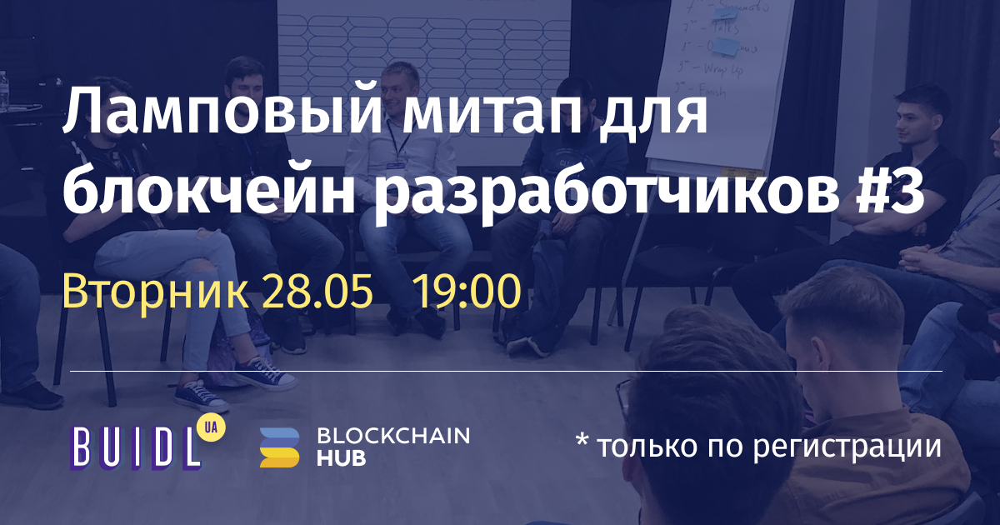

# Митап \#3 – 28.05

## Доклады



## Монополии в блокчейнах

у нас есть алгоритм в консенсусах – пруы чего-то. Нода должна владеть чем-то для прува консенсуса, чем больше она владеет, тем больше вознаграждения она получается.

Проблема в том, что если мы сделаем пруф чего-угодно, то все ноды будут участвовать в процессе гонки оптимизации и это приведет, что те ноды, у которых больше этого прува, то у них больше заработок и у них больше возможности инвестировать этот заработок.

Не совсем так, пример битмейна – естесвенная монополия с пулами хешрейта более 50, а теперь у них процент хешрейта меньше 30.

Это общее правило потому что было много таких пулов с больше, чем 50% хешрейта и все они уходили и мы это уже переживали.

С PoS непонятно потому что у нас нет очень старых PoS сетей

что ведет к монополизации – оптимизация от масштаба – каждый следующий айтем идет дешевле предыдущего. С економ точки зрения –у тебя есть оптимальная точка размера структура тчобы не налажать с менеджментом и структурой, где все будет сходиться. Очень большие пулы становятся огромными потому что они следуют более рисковой стратегии и потом сдуваются.

Вопрос про риски – риски с эконом точки зрения – тчо такое купить ассет майнер, купить фюччерс на доставку битка это поставить на то, что ты купишь, а другие не купят и твой хеш-павер будет расти медленее, ечм цена. Какой тут риск – в 2017 на всю котлету купить оборудования.

Про сценарий реинвестиции прибыли на RnD следующего поколения майнеров? Оо

Экономическая модель такая, чтто тебе намного выгоднее продавать, чем майнить на них – не смотря по какой цене они будут. Сейчас мы придумали супер-асики – даже если мы уверены, что мы луччше всех сделали – если мы все пойдем в эту игру, то мы не получим первого профита.

Если мы получичм 10% профита – то дальше надо скейлится – если ты производитель и с

Возможен ли барьер взода, который позволяет вход новых игроков,

Если порог входа низкий – они делают рынок, если порог входа высокий – то мы не можем получить так много иксов.

Можно делать инновации чтобы менять не асики, а инновации в електричестве.

можно делать PoS

Если DPoS – мы делаем деньги – это олигополия

Елси в EOS – там конституция. Light centralization – но мы не можем говорить о том, что они тру децентралайзд.

Самое главное в PoS - в том, что он опирается на сущность созданную внутри себя же. Если в пов у нас есть внешние майнинг утилитис, то в ПОС это есть слабым звеном.

Последний коммент от соболя – идея в том, что у нас, полуается есть критика, тчо в посе есть сущность которая генерируется самим посом, но она не является валидной потому что

как люди спользуют моенты – они их используют и так у нас исключается из модели то, что люди используют этот токен.

прувить все с точки зрения conputer science стоит, а с точкни макроэкономики, пожалуй, не стоит.

## IOT – необходимость небольшие файлы, но много маленьких сообщений

Интро – писать все в поле memo платежей мелких коппек в сети EOS – если вы знаете более дешевых

Есть два стандартных решения – свой ipfs, второе – когда у вас есть рынок файлового стореджа – где вы можете купить сторедж за мелкие деньги.

Проблема – если вы храните данные на блокчейне, то это дорого потому что оно хранитсяна всех нодах.

или можна подождать пока сделаются решения для стореджа.

Матвей смотрел на проекты с 17го года... и кажется что вот-вот, но не.. пока не

что они делают – ты можешь им закинуть любой тип файла – ты платишь внутренними монетками за хранение, а они реплецируют штуку 6 раз \(можно увеличчить кол-во за доплаты\) там нет как в ипфс ссылок и извне блокчена нельзя к ним стучаться, там нет метамаска, но оно работает. Это, наверное, самое худшее решение, но других нет.

Реально пощупать ничего нет. Файлкоин предлагал интересную систему консенсуса.

Майнинг на HDD. CIA?

Должен быть клиент – проблема, Как? UI для CIA жто стартап.

Заччем UI? потому что если я буду использовать UI или light node – то это я сначала кому-то на ноду свои файлы, то потом

Urbit?

Filecoin есть пруф о сторедж, но еще не сделали.

Сторедж не должен быть проектом коина – он должен быть клиентом какого-то

должен быть смарт контракт, который дивет пока ему платят и это более-менее реально и для этого нам не нужно каких-то монструозных проекто.

Можель CIA не идеальна

ну как, они имутабельные – это дорого, это знаичт, что их надо хранить, и ты ведь платишь за это, но я хочу положить данные

по поводу рынка ресурсов – если мы реально хотим сделать протокол, нам нужны отдельный субъекты, которые будут хранить файлы – нужно делать хитрую систему ораклов и тебе нужно доказывать, ччто ты владеешь какой-то информацией

дальше идет дискуссия про диспуты, на которые ставится стейки

оставим в покое снарки – проблема доступности данных – допустим, я плохой субхект, у меня есть файл, я хочу получить файл назад, а мне говорят не, а я ок – идем в блокчейн –

единственный настоящий прув, что у меня есть файл это его предоставить

поччему нужен zkSNARK? у них размер подтверждения не зависит от размера файла – PoPublication – ты можешь выбрать и восстаноить файл –

А если мы берем чтото типа торрент протокола, например мы берем просто кусок, который нам не надо прямтать – у нас есть централизованный елемент – трекер. А елси просто к торренту прикрутить больше базовый крипто-сет чтобы файлик не был доступен – чтобы шейрить файлики, но заменить трекер.. да Дпосом каким-то

А трон не это ли сделал – ты можешь задонатить токен как баунти за шейринг файлика.

Тон собираются инсентивизировать просто раздау файлов, а мы говорим про то, как застваить людей ф\) зранить чужие фаыл ь\) не иметь к ним доступа и тчобы все хранили и распространяли файлы.ю Суть в распротранении - и получается какойто комунизм %\)

у тона была идея, что ты ставишь пир баунти и все, кто раздают файл получаются процент от пир баунти

а зачем? я за торенты никогда не платил и все нормально я никогда не испытываю проблемы скачать айл

ты выложил файл на торент и хочещь его дец. хранить, для всех он светится, тчо ты залил файлы и все пиры получают баунти за то, что они хранят файлы

а какой кейс? елси я хочу хранить картинку – дупустим мой ню фотку, я залил в блокчейн и отправить девушке и быть уверенным, что его никто не увидит! Какие файлы мы сможем/ будем там хранить

для того кейса сущ

## Баззворды

как отличить скам от не скама, как очистить проект от баззвородов и понять его. Как отличить хороший проект от хорошего.

та никак – нету такой идеологии, в которую не прилезут красть-воровать и обманывать.

RavenDuck – форк форка битка, ravena. У них там web 1.0 дискорд телеграм, непонятно залистились ли они где-то.

Стандартный економиеский ответ– в том, что у тебя настоящая сущность должна слать тяжелый сигнал – например для священника придумали обет безбраччия чтчобы этоне было легко. У Талеба книга Skin in the game – хорошая потому что она исследует вот те все ассиметрии. Должна быть демонтрация шкуры на кону.

Дорогое сигналирование – любимое увлечение скамеров. Кждый понзи-коин в азии наччинают свое исо с того, что они приглашают опинион-овнеров на конференцию в Дубаи. И они постоянно изобретают новые способы задекларировать свой богатство и они заскамливают Дубаи, Монако, etc.

## Фидбек

если есть лайтнинг толки, то можно делать и лайтнинг воркшопы

поднять цену на вход и сделать больше еды

в след раз обсудить – как мы за 10 минут обсуждения можем решить все проблемы мира

фолоу-апчик в конфе

выкладывать темы заранее – тобы можно было готовиться

в сабстрейте была AmA сессия на сайте – задавать вопросы во время выступления – можно так сделать с темами

попробовать позвать какого-то крутого чувака в скайпе

проблема с определением тем – на ходу тяжело сориентироваться по назвнию

можна делать онлайн трансляцию – чтобы накопить вопросы и задать потом

Сделать пул вопросов тчобы были заранее

прикольный формат – надо заставить тех, кто моличт, говорить. Сделать пруф оф спик. Не ожидал, что прикольно

легкая оптимизация – надо делать несколько кружков! Сделать предложение по три кружка.

– та надо просто водный в центре кружка поставить тчобы норм было

Надо убрать микрофон.

анонсы и чтобы было ДХ

раньше начинать

