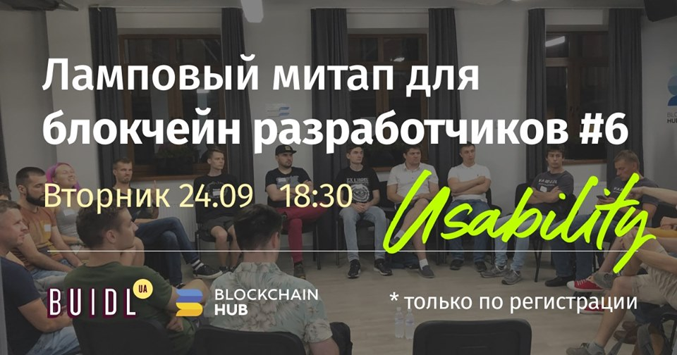

# Митап \#6 – 24.09

Время: 24.09 \(Вт\) 18:30 – 21:00 Место: Blockchain hub \(Верхний Вал 10\)

Стоимость участия 250 грн.

[**Регистрация тут**](https://docs.google.com/forms/d/e/1FAIpQLSfbAA4Kf428jMcVYH6b2JkeSEN2v4c51AvgeqeqqmLMUdeLgA/viewform?usp=send_form)\*\*\*\*

### Доклады

* Олег Кудренко, что-то про Snowball и юзабилити популярных блокчейн продуктов
* Bohdan Melnychuk \(The Drote of Blockchain =\) – Layers of Economic Abstraction in Blockchain

### Вопросы на обсуждение

* Влияние Developer Experience на адопшшн
* Ethereum usability: Universal login, Gas Station, Burner Wallet etc
* %добавляйте свои%

