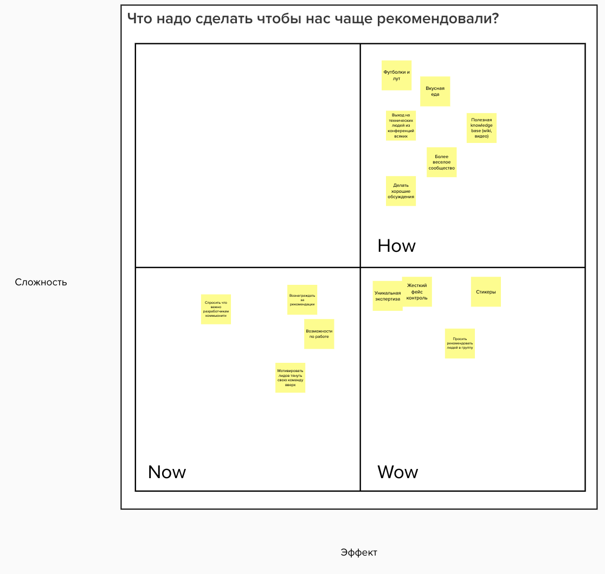

# Стратегия

## Brand

* образование, учеба, продукты
* достала галера – добро пожаловать к нам

## Advisory Board

* Ната
* [Фишкин](https://www.linkedin.com/in/vitaliyfish/?originalSubdomain=ua) \(@vitaliyfish\)
* Ольшанский

## Идеи

* Перевести BUIDL на английский
* База скилов
* 10-20% от привлеченных денег
* Integration with global buidl x100
* ICO pump показал что все должны работать вместе и дало восприятия продуктов
* Риски фаундерства и безденежья

### Почему Украина не лидер по блокчейн продуктам?

* Продуктовая экспертиза
  * Образование
  * Коммьюнити
* Плохая юрисдикция
* Аутстаф голодный и пылесосит людей
* нанимали "волшебных" людей для питчей, нет опыта работы под кем-то
* оторванность от реального мира
* отсутствие образования
* информационная поддержка
* не проходят международные конференции
* нет поддержки экосистемы
* \(микро\)финансирование - фандинг рисерчей
* люди сваливают, а не приезжают наоборот
  * те кто поняли что такое стартап уже на стадии уезда
  * нет понимания что такое стартап
  * низкая планка модерации и людей
* нет или мало пользователей
* мало инженеров \(всего до 1000 людей активно заинтересованы в крипте\)

### Информационная поддержка

* Расписать компании, продукты, инициативы и тд в блокчейн пространстве в Украине. Веб страничка, мб бумажная версия.
* Партнерство BAU, Blockchain UA, Forklog

### Международные конференции

Devcon, EthHackathon...

### Продуктовая экспертиза

* Качать дизайн синкинг и лабу
* Собирать/шерить кейсы
* Приглашать крутых специалистов проводить в бидле дизайн спринты

## Блокчейн разработчики

* Знания
  * читать доклады
  * собирать специалистов в области. Например, Соболя.
  * сделать вики
  * вебинары
  * умные постики в социалочках
  * Постить видео на форклог
* Общение
  * делать офлайн митапы
  * модерировать телеграм группу
  * находить / добавлять специалистов в группу
  * Помогать находить команду для хакатона
  * Взаимопомощь в будни советами, etc
* Нетворкинг
* Исследовать и Делиться знаниями
  * Собирать запросы на темы
* Продвигать украинские продукты зарубеж \(клиенты, партнеры, инвестиции\)
  * сотрудничать с BAU, особенно по внешним контактам

Идеи:

* Подключить ядро ребят для составления программы \(Богдан?\)
* Open value network

## Протоколы/технологии \(спонсоры\)

* продвижение технологии / увеличение адопшна
  * [https://nearprotocol.com/ambassador/](https://nearprotocol.com/ambassador/)
  * сработать с Parity
  * проводить хакатоны
  * читать доклады на тему технологии
  * проводить воркшопы по построению приложений
  * раздавать SWAG
  * Делать вместе с BAU/Blockchain hub

### ⚽Improve Developer Experience for protocols

* исследования кто сейчас делает в этом направлении
* анализ devX для платформ \(например remix\) - можно даже получить грант
* юзабилити для девелоперов \(DevX\)
* понять кому этот юзабилити важен
* сделать анализ по юзабилити самых массовых и ценных приложений
* Исследования кто сейчас делает в этом направлении
* Поддержку можем обеспечивать на постоянное основе
* особенно хорошо для новых проектов
* Нужны дизайнеры, технические райтеры и переводчики \(для документации\)

Projects

* Near
* Libra
* Minter
* Parity
* Chromia
* Cosmos
* Tezos

### [🤹](https://emojipedia.org/juggling/)Blockchain Team Extension

People:

* [Kirill Kirikov](https://wiki.4irelabs.com/docs/about/kirill-kirikov)
* [Bohdan Malkevych](https://wiki.4irelabs.com/docs/about/bohdan-malkevych)
* [Roman Malkevych](https://wiki.4irelabs.com/docs/about/roman-malkevych)
* …

Skills:

* Proficiency in Ethereum \(Smart contracts, Ethereum Ecosystem tools and knowledge, Knowledge of how to build decentralized systems instead of centralized backend\)
* DApps Development \(any FE/ any BE ~node.js, python, vue.js, react\) +
* Cryptography knowledge: \(Encryption / ZK / Elliptic Curves / Hashes\) +
* Blockchain Core \(merkle trees, consensus mechanisms, balance and TX0 model\) +
* Browser extensions
* DevOps \(Setting up nodes, infura, the security of nodes\)
* Bridges and cross-chain assets transfers
* Rust

#### Get/Stay in touch with the web3 projects

Use buidl ua as the platform – great UA engineers

#### Create More Effective Engineers

#### Программа стажировки 

#### Делать классно оупенсорс проекты

* отладить процесс через github
* документация и тд
* оформить наш github

## Лидер/HR в IT компаниях

* Хайринг
  * делать рассылку с вакансиями
  * собрать профайлы мемберов по специализациям
  * Давать возможность презентовать проект и сказать про хайринг

## Хосты / коворкинги

* популяризация коворкинга / продажа зала и еды
  * давать слово коворкингу в какой-то момент митапа,
  * добавлять в рассылке

Привлечь больше разработчиков в коммьюнити

## Идеи

* Вступать в коммьюнити только по докладу, коммьюнити выбирает кого слушать
* Вырезать правила [https://www.youtube.com/watch?time\_continue=152&v=fwx1-zAVBJk](https://www.youtube.com/watch?time_continue=152&v=fwx1-zAVBJk)

## Привлечь больше разработчиков в коммьюнити

### Просить коммьюнити рекомендовать

### Внешние источники

* Зайти через блокчейн.юа _– в процессе_
* Из других коммьюнити \(софтвейр архитекты, реакт, питонисты\) _– в процессе_
* Из других блокчейн митапов
* Forklog _– в процессе_
* ЩоБиткоиться _– в процессе_
* Xteams _– в процессе_
* Законнектиться в глобальный бидл чтобы дали на нас ссылку  _– в процессе_
* Анонсы на ДОУ
* Статья на ДОУ
* Продолжать постить на Митап.ком
* Distributed Labs каналы
* Попросить пошерить в слаках внутри укр продуктовых команд
* Рассказывать про наше коммьюнити на общетехнических ивентах
* Кросс маркетинг с техническими ивентами \(конференции и т.д.\)

## Решение проблем

* Чередовать митапы по темам \(privacy, scalability, usability etc\)
* Создать форум с сабтопиками по проблемам?
* Invite to labs

